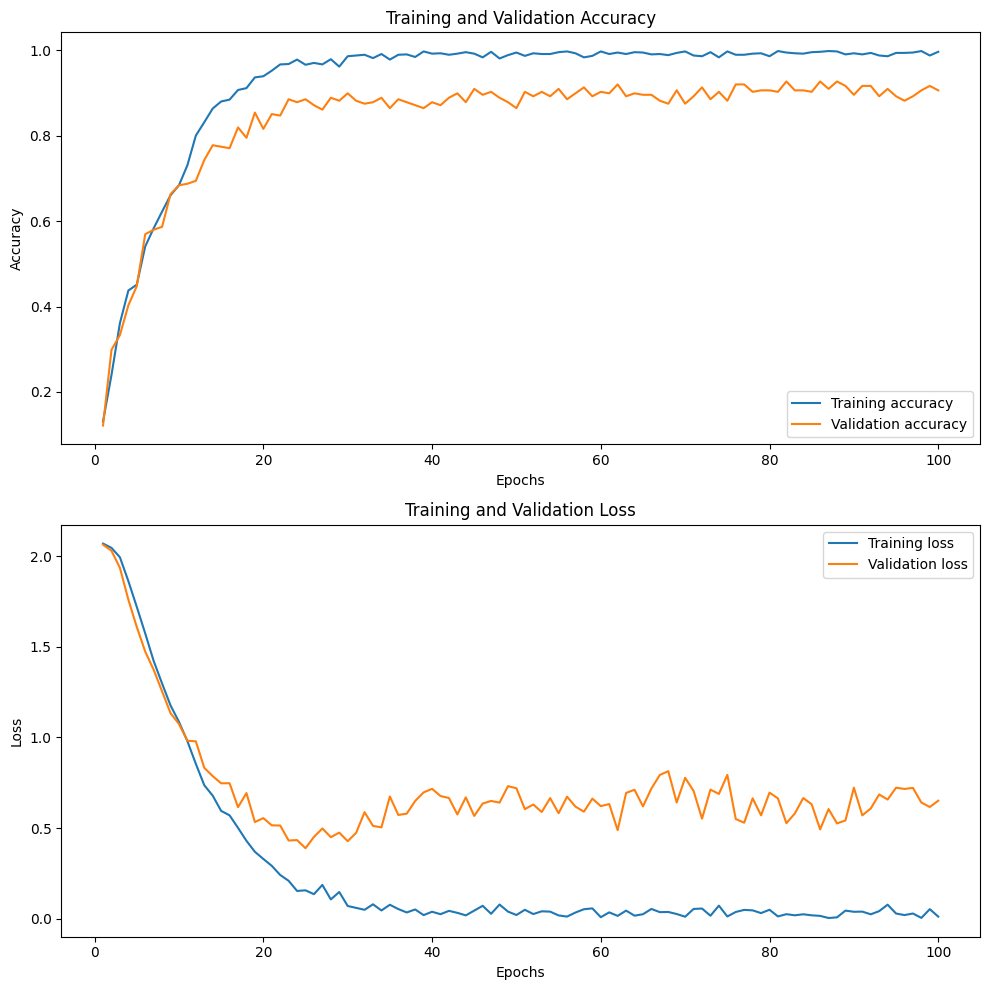
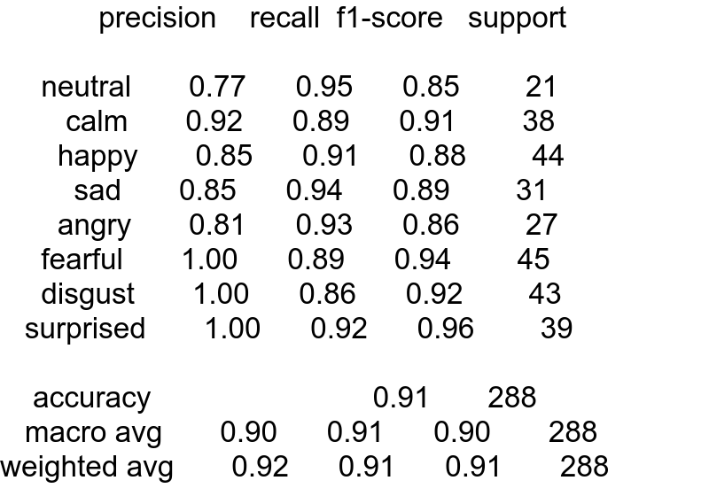
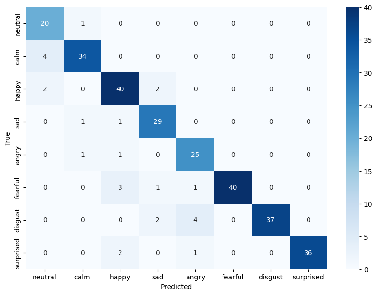
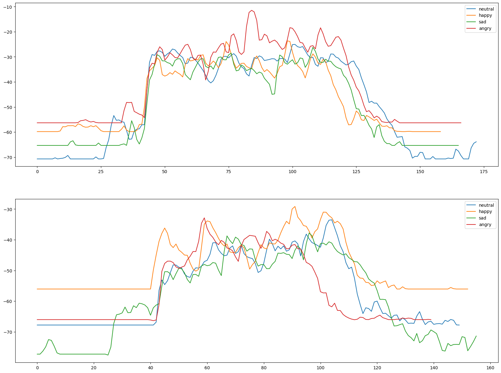
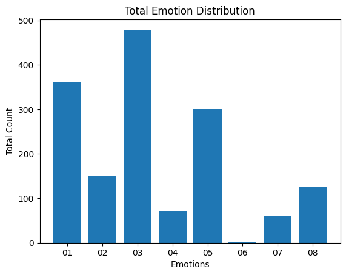
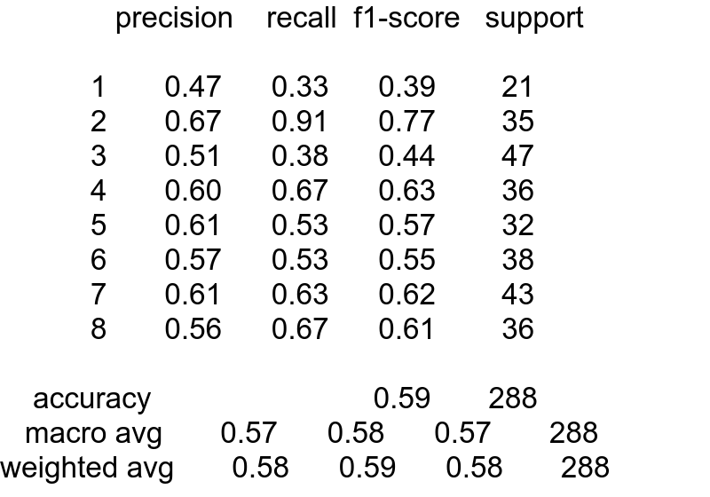
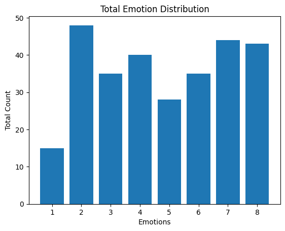

# Voice AI Research for Vk_lab
## Содержание
1) audio_mood.ipynb основной файл с обученной моделью WAV2Vec2 и анализом результатов. Также приведено сравнение с базовой моделью и анализом сигналов + выгрузка результатов
2) Файл c прогона на тестовой выборке называется: output.txt (данные в формате file_id |01 | 02 | 03 | 04 | 05 | 06 | 07 | 08 | )
3) Файл с фитчами eGeMAPSv02 был выгружен в features.csv (при выполнении кода важно его выгрузить, и загрузить как в коде, либо взять его и перейти к обработке данных)

## Файл содержит в себе ссылки на диск на загрузку датасетов и обученной модели, также привожу их тут:
1) RAVDESS -> https://drive.google.com/file/d/1gn79SrzmBDclSP6q75UUs2hZ42cIeqkf/view?usp=sharing
2) Тестовый датасет -> https://drive.google.com/file/d/1--3dUqmNRJyhj2Ht1gl9ktoRaafbuHhw/view?usp=sharing
3) Веса и состояние оптимизатора модели (.pth) -> https://drive.google.com/file/d/1ZZPWhGp5fd3VrtBNI4EXo8QF5ogQIUy4/view?usp=sharing

### Плюсы Wav2Vec 2.0:
1) Энкодер модели извлекает признаки из самого аудиосигнала без привязки к языку, его транскрипции. Он также сжимает признаки в вектор фиксированной длины, тем самым модель учится предсказывать сигнал используя только часть спектра(как в nlp, маскируя участки сигнала и учиться предсказывать их).
2) Предобученная модель Wav2Vec 2.0 может быть использована для ряда задач: распознавание и классификация аудиосигналов, распознавание голоса, извлечение текста. Причем точность перевода сигнала в текст высокая.
3) Можно использовать модель для перевода аудио в текст, а далее работать с готовыми классификаторами(сентимент анализ и тд)

### Минусы Wav2Vec 2.0:
1) Обучение модели 'jonatasgrosman/wav2vec2-large-xlsr-53-english' требует больших ресурсов(файнтюнинг гиперпараметров занимает какое-то время).Требуется более аккуратный подбор гиперпараметров для конкретной задачи, учитывать особенность архитектуры(заморозка/разморозка слоев).
2) Требуется дообучение на огромных данных(пробовал уменьшать размер обучающей выборки, качество стремительно падало).
   
## Особенность выбора wav2vec2 для задачи классификации эмоций
Удобство работы, модель имеет встроенный автоэнкодер, падающий уже взвешанные признаки на вход модели. Нет необходимости иметь глубокие знания в анализе аудиосигналов(harmonics, mel_spectrogram, chroma, mfcc, spectral contrast, pitches and magnitudes и тд) Важных для анализа эмоций. В этом случае есть готовый интерфейс, дающий хорошие показатели. Ссылки на использованные ресурсы:
1) Познавательные видео: https://youtube.com/playlist?list=PL-wATfeyAMNqIee7cH3q1bh4QJFAaeNv0&si=EhmZAE-tJuD9PQos
2) Стаья по распознаванию эмоций на греческом языке: https://github.com/m3hrdadfi/soxan/blob/main/notebooks/Emotion_recognition_in_Greek_speech_using_Wav2Vec2.ipynb?ysclid=lnu8h22nnc158063470
3) Работа с базовой моделью и анализом сигналов была мотивирована работой: https://www.kaggle.com/code/ejlok1/audio-emotion-part-3-baseline-model/notebook
4) Предобученная модель для перевода аудио в текст: https://huggingface.co/jonatasgrosman/wav2vec2-large-xlsr-53-english
5) Cсылка на Wav2Vec2: https://huggingface.co/docs/transformers/model_doc/wav2vec2
6) Работа с использованием CNN: https://github.com/huaiyukhaw/speech-emotion-recognition/blob/master/CNN.ipynb

## Особенности RAVDESS в файле(audio_speech_actors_01-24) и разделения train\test
* Имеются две фразы
* 24 Актера (мж и ж) с разными тембором и высотой голоса
* Каждая фраза воспроизводится дважды с различным тоном(или немного отличным, кому как), важно иметь небольшие возмущения сигналов, либо генерировать шумы искусственно чтобы нейросеть училась предсказывать метки классов с учетом аугментации, как, например делалось в той же работе -> https://www.kaggle.com/code/pranavbelhekar/audio-emotion-classification-part-3 
* В каждом файле по 60 аудиосигналов, распределение по эмоциям каждого актера таково: по 4 сигнала для neutral, по 8 для остальных эмоций, в сумме для всех актеров 96 сигналов для neutral и по 192 для остальнымх семи эмоций
* Использовалось случайное разделение 20/80 с помощью random_split, а не по актерам, позволяет избежать переобучения конкретным фразам или актерам 
* Длина сигналов примерно одинаковая(была выровнена до signal_length = 60000)
* Можно визульно разделить яркие эмоции от пассивных на основе анализа mcfc(The Mel-frequency cepstral coefficients )или энергии(амплитуды^2 сигналов)

### График функций потерь и accuracy на train и test
<figure>
  
</figure>    

### Таблицы с метриками  
<figure>
  
  <figcaption>Таблица 1 - Метрики, посчитанные на val_dataset</figcaption>
</figure>  
Функция потерь на валидационной выборке начинает расти, причем классы распределены не равномерно(neutral вдвое реже), важно обратить внимание на f1 метрику

Результат валидации хорошо виден тут:

### Confusion matrix on validation
<figure>
  
</figure>    
Низкая точность предсказания на neutral ожидаема(данных меньше), а вот от 'angry ' и 'hаppy' как от более ампитудно-выделенных сигналов, ожидалось точность выше. Если анализировать mcfc карту глубины, усреднив данные по оси времени, действительно, визульно тяжело различитить различающие особенности этих двух эмоций:

### Signal processing
<figure>
  
</figure>   

Обученную модель прогоним на тестовой выборке и посмотрим результат предсказаний(преобладание тех или иных эмоций)

### Results on test dataset using wav2vec
<figure>
  
</figure>  

Сравнение с базовой моделью(RandomForest), отбор функциональные признаков был совершен с помощью библиотеки asmile с небольшой моделью eGeMAPSv02 (88 функциональных признаков)

### Таблицы с метриками  
<figure>
  
  <figcaption>Таблица 2 - Метрики, посчитанные на val_dataset</figcaption>
</figure>  

### Results on test dataset using RandomForest
<figure>
  
</figure>  

Начата попытка разобраться с тонкостями обработки сигналов

### Обсуждение, идеи
* Выбранная модель 'jonatasgrosman/wav2vec2-large-xlsr-53-english' хорошо себя показала на RAVDESS, требуется наладка токенов (sep_token, cls_token,
mask_token). Выглядит грязновато, согласен. Требуется борьба с переобучением; предлагается обучиться на большем батче, и заморозить входные слои в начале обучения.
* Для базовой модели выбрать более широкий спектр признаков, например, использовать большую модель, ComParE_2016 или что-то еще. Провести анализ полученных признаков, выявить их актуальность для задачи классификации эмоций.
* Взять и обучиться на других датасетах: SAVEE, TESS , важно выбирать разные диалекты, интонации.
* Использовать несколько моделей для классификации, применить взвешанное голосование

